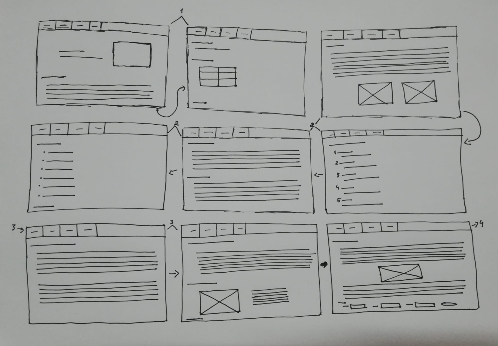
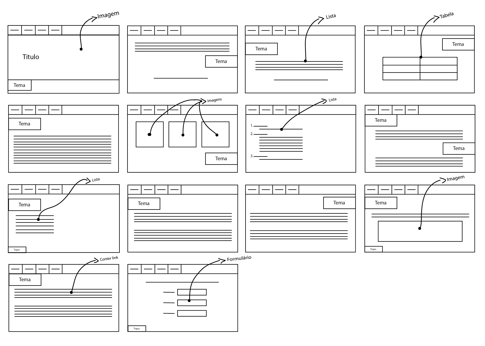
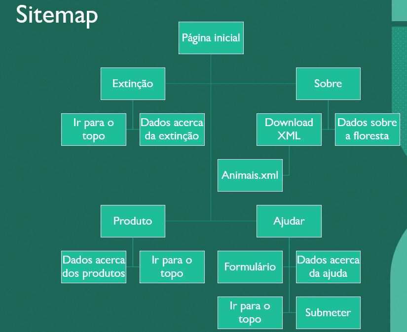
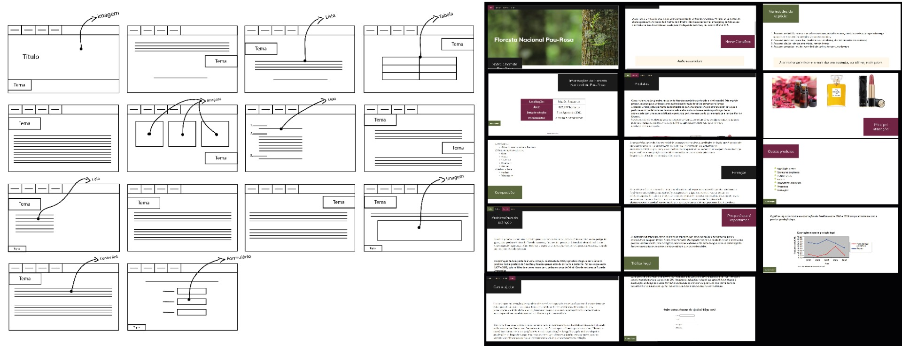

# Rlatório trabalho prático de avaliação contínua 2021/22
## C1: Apresentação do projeto
Este trabalho prático tem como objetivo desenvolver um conjunto de, pelo menos, quatro páginas estáticas, criando um sítio Web com recurso a XML, HTML5, CSS3 e Javascript.
A área temática do trabalho é “Florestas”, tendo como tema específico do trabalho, escolhido pelo nosso grupo, a “Floresta Nacional do Pau-Rosa”. Sendo pedido ao grupo a definição do tema a partir da preparação de um texto, cerca de 250 palavras, acerca do tema do trabalho a desenvolver tendo em atenção os requisitos enunciados.
O trabalho tinha como objetivo refletir e apresentar um conjunto de informação relevante sobre o respetivo tema, desenvolvendo assim 4 páginas HTML estáticas, 1 documento XML e respetivo schema para validação, em que o conteúdo e estrutura do documento deverá ser relevante para o trabalho. 
Os documentos HTML tinham de apresentar uma correta marcação semântica do conteúdo, isto é o uso correto dos elementos section, article, nav, aside, address, header, footer, figure, main, div, ... Nos documentos HTML deveria existir pelo menos um exemplo de tabela; uma listas; marcação correta de texto com destaque com alteração da formatação padrão através de CSS; imagens e inserção por CSS, ligações; formulário.
Nos documentos CSS deveria existir pelo menos um exemplo de cada um dos tipo de seletores simples; seletor de pseudo-elementos e seletor combinador; propriedades do texto e da fonte; formatação do fundo de página com utilização de imagem de fundo e cor de fundo; formatação de estilo para uma lista; manipulação dos 4 elementos de formatação da caixa de elementos HTML; utilização de propriedades de flutuação; de posicionamento e combinadas – flutuação e posicionamento; esconder um elemento; formatação de uma tabela; substituição de um elemento por uma imagem e por ultimo responsividade para duas dimensões de ecrã (media queries).

---

## Grupo 03
- Daniela Silva @
- Gonçalo Lopes @
- Paula Moreira @

---

## C2: Interface com o utilizador

### Sketch

### Wireframes

### Sitemap

### Comparação do estudo inicial com o resultado final

----

## C3: Produto 

O tema do nosso projeto é sobre a “Floresta Nacional do Pau-Rosa”, o pau-rosa são árvores que podem atingir até 30 metros de altura, com troncos de dois metros de diâmetro. Essa espécime produz um óleo que é utilizado como essência na fórmula de vários perfumes na Europa e Estados Unidos, sendo utilizado em muitos outros produtos.
O projeto esta dividido em 4 partes, a página principal, onde há uma contextualização, com dados e alguma história acerca desta floresta; outra acerca de produtos provenientes da madeira das arvores Pau-Rosa; outra que expõe a problemática da procura em excesso e a extinção da espécie como resultado; e, finalmente, uma secção com informações acerca de como as pessoas podem ajudar a causa.

Relativamente à estética do website, pretendemos usar uma palete de cores que se assemelhe às cores da árvore Pau-Rosa. Contendo diversos elementos como por exemplo um tabela para nos ajudar a organizar melhor os dados; lista ordenada para podermos ordenar o valor da essência das diversas variedades desta espécie; listas não ordenadas para indicar produtos provenientes do Pau-Rosa; e muitos outros elementos.

### Regras de utilização

- O utilizador é responsável por guardar e utilizar de maneira correta os dados do website e dos seus conteúdos. Mais em concreto, os utilizadores são os únicos responsáveis pela comunicação de informação ou de dados incorretos, falsos ou de terceiros, sem o nosso consentimento, bem como pela utilização incorreta dos mesmos.
- O website disponibiliza ligações (“Links”) para outros websites de terceiros, as respetivas ligações são incluídas para fins exclusivamente informativos de como pode ajudar de uma maneira diferente. Mas não assumimos responsabilidade pelos diversos conteúdos ou produtos, assim como por quaisquer danos ou prejuízos que possam resultar da utilização pelo utilizador, bem como quanto ao tratamento de dados pessoais durante as operações de navegação na internet. Sendo assim exclusiva responsabilidade e risco do utilizador, tendo assim que prestar atenção quando liga a outros websites e ler com muita atenção os termos, condições e política de privacidade.

### Ajuda à navegação

O website contem um menu que está dividido pelos 4 temas abordados, sendo assim de fácil utilização, pois o utilizador pode ir direto aquilo que realmente lhe interessa sem ter de fazer grande procura. 

### Validação do formulário

O formulário contém 3 etapas para serem preenchidas: o nome; e-mail; e para finalizar, a mensagem. Se o utilizador não preencher algum desses campos e clicar em "Enviar sua mensagem", aparecerá um aviso de que falta preencher um dos campos, não deixando assim enviar. O mesmo acontecerá se no e-mail se esquecer, por exemplo, do @ ou se na mensagem não alcançar o mínimo de caracteres (8), não podendo também ultrapassar os 100 caracteres.

### Validação do HTML e CSS

Para a validação do HTML e CSS utilizamos W3C Validator

### Detalhes de implementação

Para facilitar a navegação o grupo implementou um menu interativo com todas as paginas disponiveis

        

            <a class="active" href="principal.html">Sobre</a>
            <a href="produtos.html">Produtos</a>
            <a href="extincao.html">Extinção</a>
            <a href="ajudar.html">Ajudar</a>
        

Aqui dá para ver as 4 páginas requiridas

O css foi feito em separado

                .topnav {
        overflow: hidden;
        background-color: rgb(27, 27, 27);
    }
    
    .topnav a {
        float: left;
        color: #E7CDAF;
        text-align: center;
        padding: 14px 16px;
        text-decoration: none;
        font-size: 17px;
    }
    
    .topnav a:hover {
        background-color: #5A663C;
        color: rgb(255, 255, 255);
    }